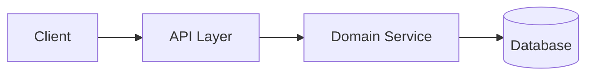

# Skill: Architecture Doc Writer

## Purpose
Generate `architecture.md` from the finalized architecture recommendation.

## Description
Generates `architecture.md` from the finalized architecture recommendation.

## Trigger
Used by: Architecture Agent - Step 5 (Generate architecture.md).

## Requires
- Finalized architecture recommendation object.
- Linked requirement document reference.

## Output Location
`outputs/<JIRA-ID>/architecture.md`

## Template
```markdown
# Architecture: <Feature/Story Title>

**Source Requirements:** outputs/<JIRA-ID>/requirements.md
**JIRA ID:** <JIRA-ID>
**Date Captured:** <YYYY-MM-DD>
**Captured By:** Architecture Agent
**Status:** ** Proposed

## 1. Architecture Goal
<brief objective tied to requirements>

## 2. System Context
<boundaries, external systems, actors>

## 3. Component Diagram


## 4. Key Components
- <component>: <responsibility>

## 5. Data Flow
1. <step>
2. <step>

## 6. Technology Choices
- <choice>: <rationale>

## 7. Risks and Constraints
- <risk>
- <constraint>
```
